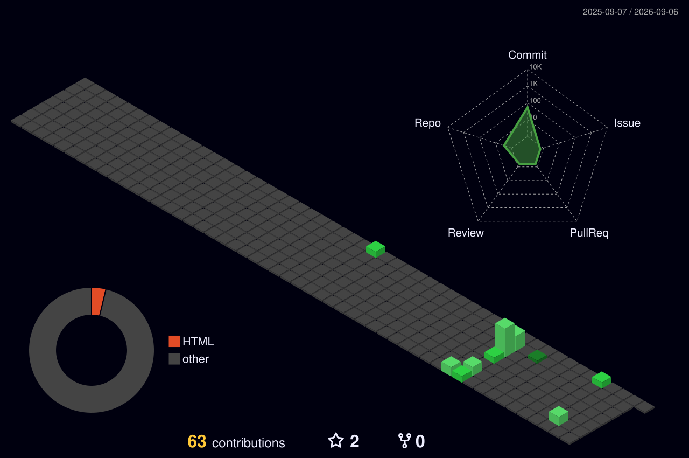

  

<h3 align="center">I love working with data and finance, turning numbers into useful insights.</h3>

  

---

<h3 align="left">🔧 Languages and Tools:</h3>

  
  
  
  
  
  
  
  
  
  

   

<!--  -->

---

  

---

<!-- Proudly created with GPRM ( https://gprm.itsvg.in ) -->

---

