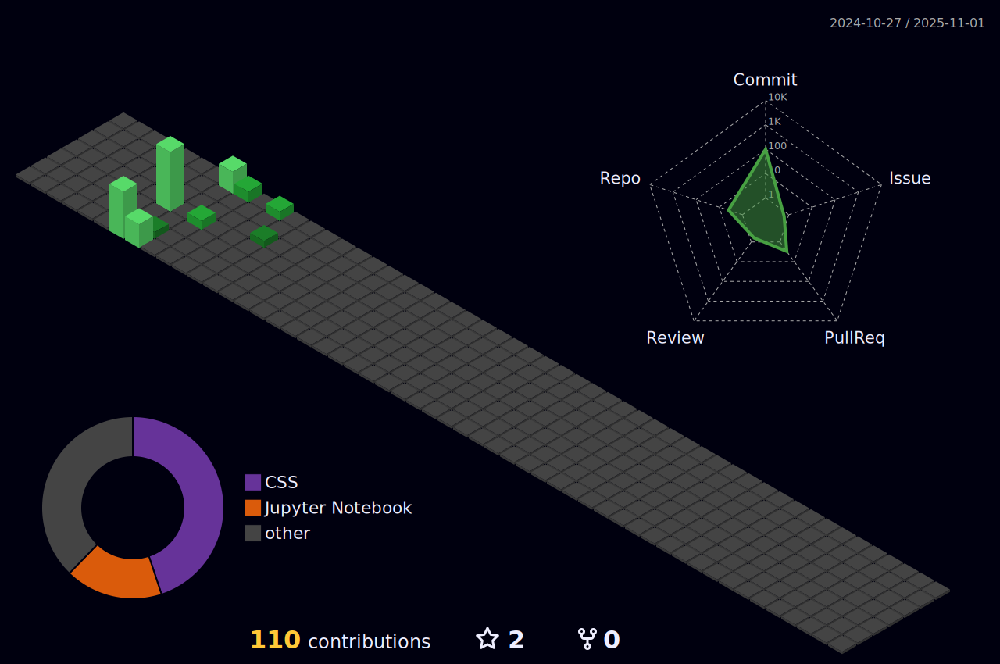

  

<h1 align="center">Hi 👋, I'm Oil</h1>
<h3 align="center">I love working with data and finance, turning numbers into useful insights.</h3>

 

<h3 align="left">Languages and Tools:</h3>

  
  
  
  
  
  
  
  
  
  

# 📊 GitHub Stats:

  
   
  

---

  

---

<!-- Proudly created with GPRM ( https://gprm.itsvg.in ) -->

   
  
  

    
  

---

